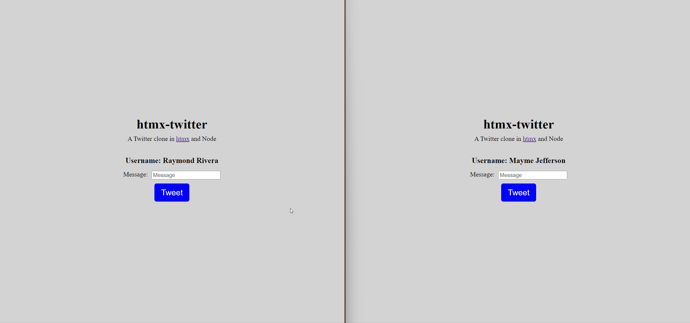

# htmx-twitter-clone
A Twitter clone in [htmx](https://htmx.org) and Node

## Usage
Clone this repo, install dependencies and start the server.
```
git clone https://github.com/Knox-Phillips/HTMX-Twitter.git
cd HTMX-Twitter
npm install
npm start
```

You can view the application in `localhost:3000`


